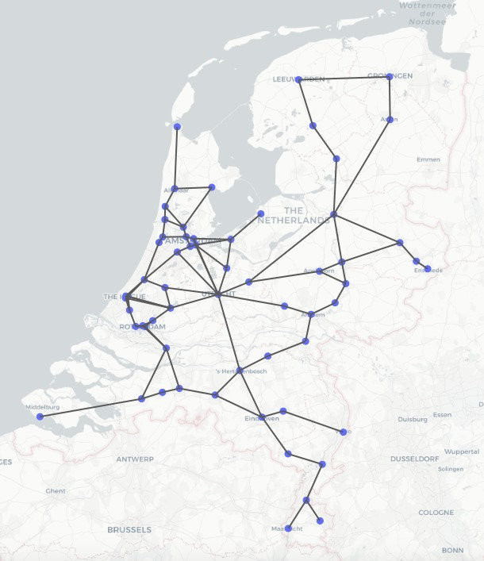

# RailNL x OLA

This project researches the train routes of intercity trains in The Netherlands. The goal is to create a set of routes that connect all important intercity stations within either Holland or the whole country. A route cannot be any longer than the given timeframe. To measure the fitness of a solution, we use the score function beneath. The goal is to find a solution for which the K score is as high as possible.

<pre><code>K = p * 10.000 (T*100 - min)
K = quality of route set
p = fraction of used connections (between 0 and 1)
T = amount of routes
min = total amount of minutes used in all routes
</code></pre>

## Getting Started

### Prerequisites
The codebase is written in [Python3.6.3](https://www.python.org/downloads/). In requirements.txt you will find all packages required for running the visualisation code. Run the following:
<pre><code>pip install requirements.txt</code></pre>

### Structure
All python scripts are stored inside the 'code' folder. Inside the 'data' folder, all csv files are stored. 

### Testing
To run the algorithms, enter the following code:
<pre><code>python main.py</code></pre>

## Autors
Olivier van Heck, Lex Poon and Annejet Robijn. 

## Acknowledgements
Minor Programmeren van de Universiteit van Amsterdam