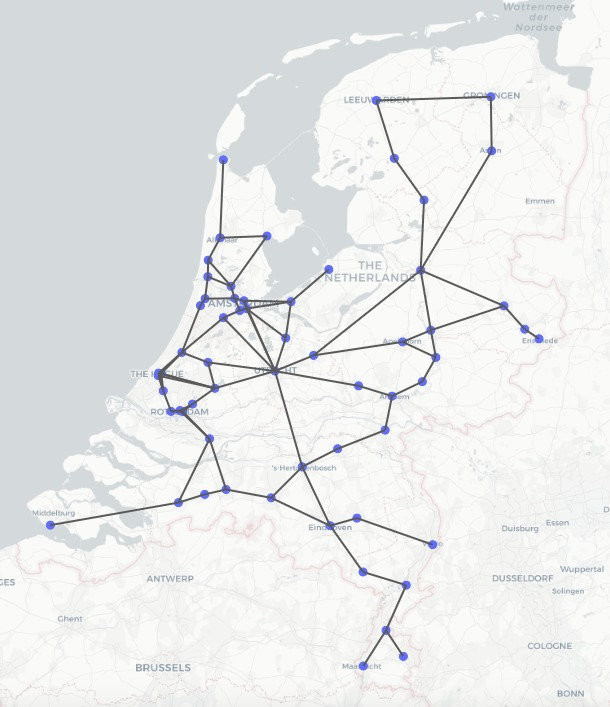

# RailNL x OLA

### The Case

The Netherlands has an extensive public transport system, offering an accessible and convenient way of travel to many people. However, this makes for a greatly complex rail route map. This project aims to find the most efficient set of train routes for intercity trains within The Netherlands. The goal of this research is to create a set of routes that connect all important intercity stations in Holland (North-Holland and South-Holland) as well as stations in the whole country. 

In Holland, the 22 most important intercity stations are taken into account. The first task was to create a set of routes for this part of The Netherlands, with a maximum amount of 7 routes. A single route cannot be any longer than 120 minutes. 

Respectively, in the Netherlands, 89 stations are included and 20 routes are allowed to be used. In this case, a route can take 180 minutes. Again, the goal here was to create a set of routes that results in a rail route map of high quality. 

Each algorithm returns a solution for either one of the above problems. A solution consists of a set of routes. 

### Quality of route set

To measure the quality of a solution, the score function beneath is used. The goal of this case is to find a solution for which the K score is as high as possible.

<pre><code>K = p * 10.000 (T*100 - min)
K = quality of route set
p = fraction of used connections (between 0 and 1)
T = amount of routes
min = total amount of minutes used in all routes
</code></pre>

## Getting Started

### Prerequisites
The codebase is written in [Python3.6.3](https://www.python.org/downloads/). In requirements.txt you will find all packages required for running the visualisation code. Run the following:
<pre><code>pip install requirements.txt</code></pre>

### Structure
All python scripts are stored inside the 'code' folder. The code folder contains four other folders: algorithms, classes, functions and visualisation. The functions folder contains a file with helper functions, a file to import data from csv's, a file to run the user interface, and a file to run algorithms that are chosen in the interface. The visualisation folder contains a file that visualizes a solution in a scattermapbox.

Inside the 'data' folder, all csv files are stored. 

The 'doc' folder contains the results of the plots.

### Testing
To run the user interface and test algorithms, please enter the following code in your terminal:
<pre><code>python main.py</code></pre>

## Autors
Olivier van Heck, Lex Poon and Annejet Robijn. 

## Acknowledgements
Minor Programmeren at the Universiteit van Amsterdam.