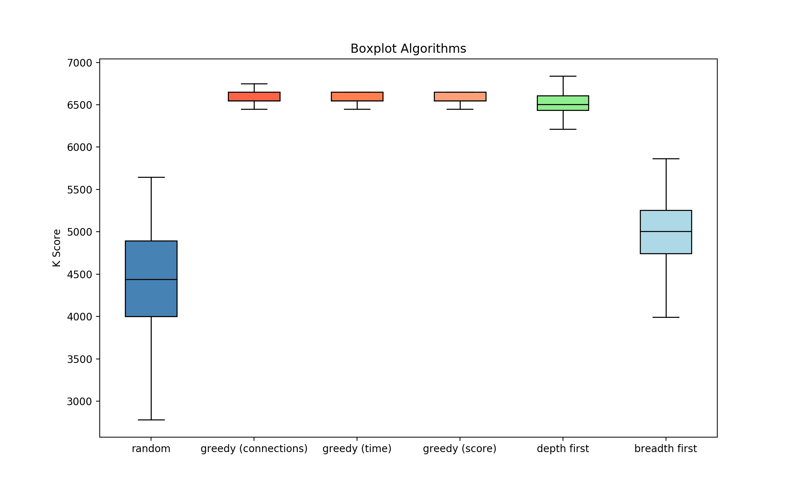
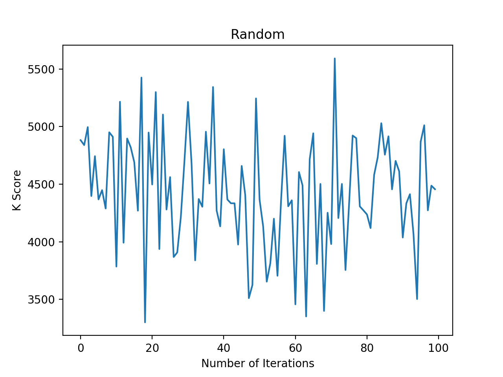
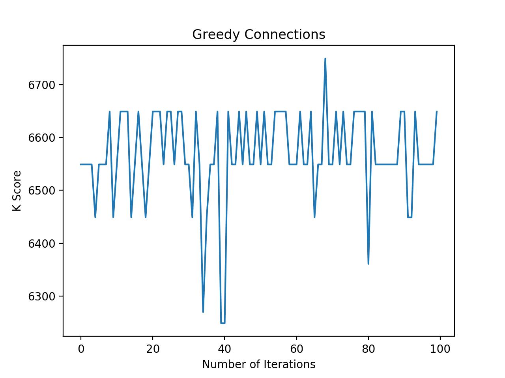
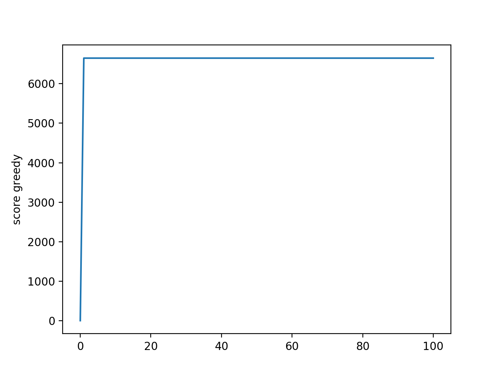
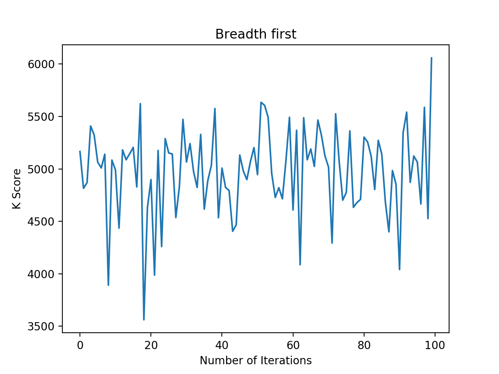
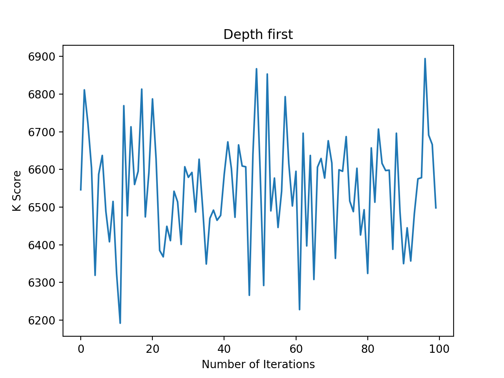

# Research

## Experimentation with input variables
First of all, we experimented with the amount of iterations for running each algorithm. We did this for 1, 10, 100, 1000 and 10.000 iterations. In general, after 100 iterations, the scores did not significantly improve anymore. In the breadth- and depth first algorithms, the score did improve a little, but due to the long running times, we chose to analyze all algorithms with 100 iterations. Additionally, in these two algorithms we have experimented with changes in the input variables depth and ratio. The lower these values, the sooner the algorithm starts pruning. We considered the runtime and the improvement of the K score, and decided on using a depth of 3 and a ratio of 1.2. This has been applied to all results.

## Boxplot: all algorithms

This boxplot shows the solution scores for all algorithms, with each 100 iterations. The plot shows that on average, the random algorithm results in a lower K score. All the greedy algorithms however, result in a much higher score. The lowest and highest scores from these three algorithms are very similar. The depth first algorithm also shows a relative high average K score, though the distance between the highest and lowest score is larger. In the last boxplot, the breadth first algorithm shows a relatively high distribution again. 

## Iterations

In the first graph, results of running the random algorithm 100 times are shown. In the second graph, results of the greedy algorithm are shown, where connections are made based on the station with the least amount of connections. It is visible that this algorithm often reaches a certain local optimum, and only once reaches a higher optmium. However, the local optimum this algorithm often reaches, is still higher than all optima the random algorithm finds. 

Both greedy graphs show similar results. In both graphs, the score fluctuates between 6450 and 6650. This can be explained, because if you take a closer look at the K function, the highest possible K score .. with a .. 

